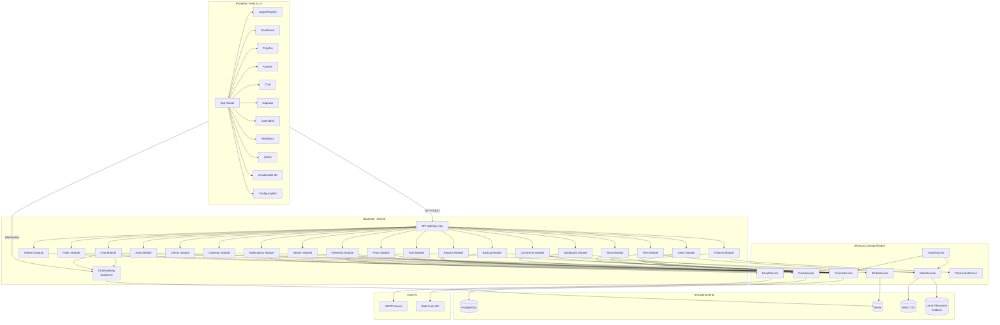
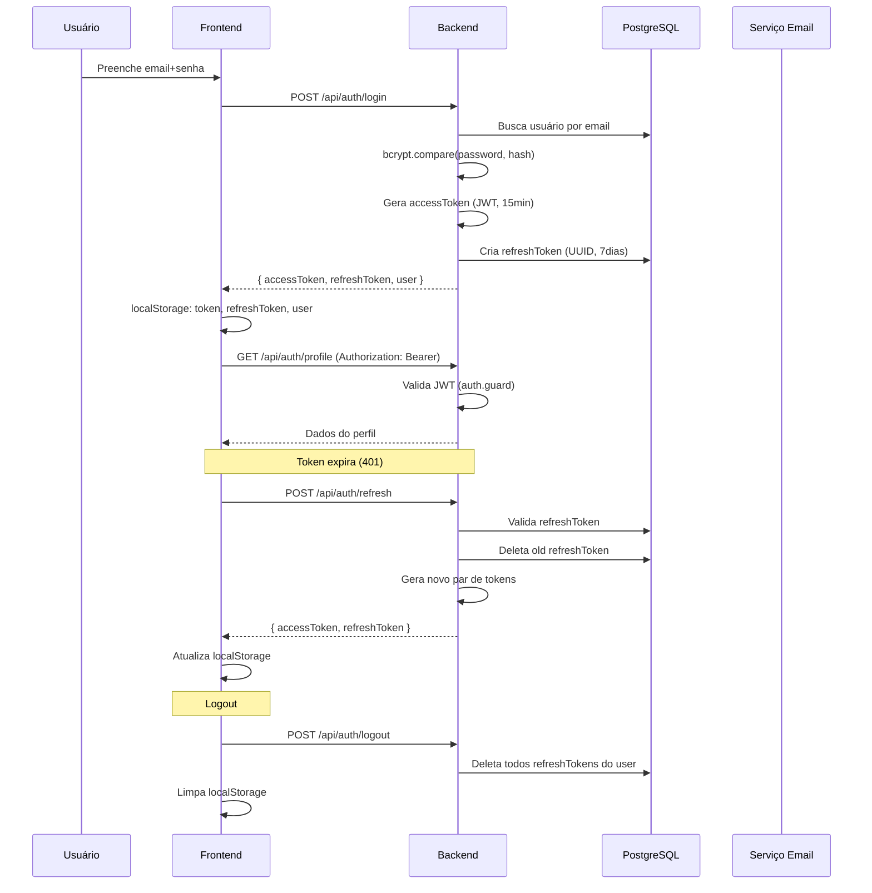

# Arquitetura Técnica

## Stack Tecnológica

| Camada     | Tecnologia                      | Versão   |
|------------|---------------------------------|----------|
| Frontend   | Next.js + TypeScript            | 14.x     |
| Backend    | NestJS + TypeScript             | 10.x     |
| ORM        | Prisma                          | 5.x      |
| Banco      | PostgreSQL                      | 16       |
| Cache      | Redis (ioredis)                 | 7        |
| Armazenamento | MinIO (S3-compatível)        | Latest   |
| Tempo Real | Socket.IO                       | 4.7.x    |
| Autenticação | JWT + Passport                | -        |
| Container  | Docker / Docker Compose         | -        |
| Testes     | Jest + Testing Library          | 30.x     |

## Estrutura do Monorepo

```
team-flow/
├── docker-compose.yml          # Orquestração dos containers
├── package.json                # Scripts raiz (dev, setup, install:all)
├── scripts/
│   └── dev.js                  # Inicialização dev concorrente
├── backend/                    # API NestJS (porta 4000)
│   ├── Dockerfile
│   ├── prisma/
│   │   └── schema.prisma       # Schema com 23 modelos
│   └── src/
│       ├── main.ts             # Bootstrap (CORS, ValidationPipe, /api prefix)
│       ├── app.module.ts       # Módulo raiz
│       ├── auth/               # Autenticação (JWT + refresh tokens)
│       ├── users/              # CRUD de usuários
│       ├── roles/              # Cargos e permissões
│       ├── projects/           # Projetos e membros
│       ├── tasks/              # Tarefas Kanban
│       ├── comments/           # Comentários e respostas
│       ├── files/              # Upload/download/versões
│       ├── folders/            # Pastas organizacionais
│       ├── groups/             # Grupos de chat
│       ├── chat/               # Chat (REST + WebSocket Gateway)
│       ├── notifications/      # Notificações push/banco
│       ├── dashboard/          # Indicadores (c/ Redis cache)
│       ├── reports/            # Relatórios + exportação
│       ├── plans/              # Planos de assinatura
│       ├── deliveries/         # Entregas e versões
│       ├── search/             # Busca global
│       ├── calendar/           # Eventos de calendário
│       ├── clients/            # Clientes
│       ├── backup/             # Backup agendado (Cron)
│       ├── audit/              # Auditoria
│       ├── trash.controller.ts # Lixeira (restauração+exclusão)
│       └── common/             # Serviços compartilhados
│           ├── prisma.service.ts
│           ├── prisma.module.ts
│           ├── redis.service.ts      # Cache lazy-connect
│           ├── redis.module.ts
│           ├── minio.service.ts      # Storage S3/local fallback
│           ├── email.service.ts      # Nodemailer (SMTP)
│           ├── push.service.ts       # Web Push API
│           ├── plan-limits.service.ts# Verificação de limites
│           ├── trash.service.ts      # Lógica da lixeira
│           ├── config.module.ts
│           ├── guards/
│           │   ├── auth.guard.ts     # JWT validation
│           │   └── roles.guard.ts    # Role-based access
│           ├── decorators/
│           │   ├── current-user.decorator.ts
│           │   └── roles.decorator.ts
│           └── filters/
│               └── pipes/
└── frontend/                   # Next.js App Router (porta 3000)
    ├── Dockerfile
    └── src/
        ├── app/
        │   ├── layout.tsx          # Layout raiz
        │   ├── providers.tsx       # AuthProvider + ThemeProvider
        │   ├── globals.css         # Tailwind + variáveis
        │   ├── (app)/              # Rotas autenticadas
        │   │   ├── layout.tsx      # Sidebar + Header
        │   │   ├── dashboard/      # Dashboard principal
        │   │   ├── projects/       # Lista + Detalhe projeto
        │   │   ├── calendar/       # Calendário de tarefas
        │   │   ├── messages/       # Chat em tempo real
        │   │   ├── notifications/  # Central de notificações
        │   │   ├── plans/          # Planos e assinatura
        │   │   ├── clients/        # Gestão de clientes
        │   │   ├── reports/        # Relatórios
        │   │   ├── search/         # Busca global
        │   │   ├── profile/        # Perfil do usuário
        │   │   ├── admin/          # Admin (usuários, roles, audit)
        │   │   └── viewer/         # Visualizador 3D
        │   ├── login/
        │   ├── register/
        │   ├── forgot-password/
        │   ├── reset-password/
        │   └── admin/
        ├── components/
        │   ├── ui/                # shadcn/ui (Button, Card, Modal, etc.)
        │   ├── layout/            # Sidebar, Header, Shell
        │   ├── tasks/             # Kanban board, TaskCard, filters
        │   ├── projects/          # ProjectCard, ProjectForm
        │   ├── chat/              # ChatPanel, MessageBubble
        │   ├── files/             # FileList, FileUpload
        │   ├── notifications/     # NotificationBell, NotificationList
        │   └── viewer/            # Visualizador 3D (Three.js)
        ├── contexts/
        │   ├── AuthContext.tsx    # Estado global de autenticação
        │   └── ThemeContext.tsx   # Tema claro/escuro
        ├── hooks/                 # Custom hooks
        ├── lib/
        │   ├── api.ts            # Axios + interceptors (refresh JWT)
        │   ├── socket.ts         # Socket.IO client singleton
        │   ├── utils.tsx         # Utilitários
        │   └── i18n.tsx          # Internacionalização
        └── types/
            └── index.ts          # Interfaces TypeScript
```

## Diagrama de Componentes



## Fluxo de Autenticação



### Detalhes do JWT

- **Access Token**: JWT assinado com `JWT_SECRET`, expira em 15 minutos (configurável via `JWT_EXPIRATION`)
- **Payload**: `{ sub: userId, email, roleType, iat, exp }`
- **Refresh Token**: UUID v4 armazenado no banco, expira em 7 dias
- **Estratégia**: O frontend utiliza o Axios interceptor para tentar renovar automaticamente em caso de 401. Se a renovação falhar, redireciona para `/login`.

## Comunicação em Tempo Real (Socket.IO)

### Gateway (`chat.gateway.ts`)

- **Conexão**: Autenticada via JWT no handshake (`auth.token` ou `query.token`)
- **Salas**:
  - `user:{userId}` — Sala pessoal para notificações individuais
  - `group:{groupId}` — Sala do grupo de chat
- **Eventos**:
  - `join:group` / `leave:group` — Gerenciamento de salas
  - `message:send` → `message:new` — Envio e broadcast de mensagens
  - `message:typing` — Indicador de digitação

### Redis Adapter (futuro)

Atualmente sem Redis Adapter (escalabilidade horizontal limitada). O planejamento inclui a implementação do `@socket.io/redis-adapter` para suportar múltiplas instâncias do servidor.

## Armazenamento de Arquivos

### MinIO com Fallback Local

O `MinioService` verifica a presença de `MINIO_ENDPOINT`. Se ausente ou localhost sem credenciais, utiliza o sistema de arquivos local (`uploads/`).

- **Upload**: Buffer → MinIO bucket `teamflow` ou disco local
- **Download**: Stream do MinIO ou `fs.createReadStream`
- **Exclusão**: `removeObject` ou `fs.unlinkSync`
- **URL**: Gera URL pública do MinIO ou `/api/files/download/:id` para fallback
- **Versões**: `FileVersion` mantém histórico completo de versões

## Estratégia de Cache (Redis)

### Comportamento

- **Lazy Connect**: Redis conecta sob demanda com `lazyConnect: true`
- **Silent Fail**: Se Redis estiver indisponível, métodos retornam `null` sem lançar exceções
- **Retry**: Máximo de 3 tentativas com backoff exponencial (200ms → 2000ms)
- **Cache atual**: Dashboard stats com TTL de 60 segundos
- **Padrão de chaves**: `dashboard:stats:{userId}`

### Expansão planejada

- Cache de consultas frequentes (projetos, tarefas)
- Cache de sessão (blacklist de tokens revogados)
- Rate limiting

## Background Jobs

### Backup Agendado (`@nestjs/schedule`)

- **Cron**: `EVERY_DAY_AT_MIDNIGHT` (meia-noite)
- **Processo**:
  1. `pg_dump` do banco (fallback: exporta via Prisma raw queries)
  2. Compactação em `tar.gz`
  3. Log de auditoria do backup
  4. Limpeza: mantém apenas os 7 backups mais recentes

## Notificações

### Email (Nodemailer)

- SMTP configurável via variáveis de ambiente
- Fallback: Log no console quando SMTP não está configurado
- Tipos: boas-vindas, confirmação de email, recuperação de senha, notificações de tarefa/entrega

### Push (Web Push API)

- Inscrição via `POST /api/notifications/push-subscribe`
- Notificações enviadas via VAPID (Voluntary Application Server Identification)
- Fallback: Log no console em desenvolvimento
- Envio em lote: `sendToMany()` com `Promise.allSettled`

## Controle de Acesso

### Guards

1. **AuthGuard**: Extrai e valida JWT do header `Authorization: Bearer <token>`. Anexa payload ao `request.user`.
2. **RolesGuard**: Verifica se o usuário possui a role necessária (via decorator `@Roles('ADMIN')`).

### Hierarquia de Perfis

- **ADMIN**: Acesso total ao sistema, incluindo auditoria, backup, gestão de planos
- **LEADER**: Cria projetos, gerencia equipes, define tarefas
- **EMPLOYEE**: Executa tarefas, participa de chats, envia arquivos

## Limites por Plano

O `PlanLimitsService` é chamado antes de operações críticas:

- **Projetos**: `checkProjectLimit()` — verifica `maxProjects` do plano
- **Membros**: `checkMemberLimit()` — verifica `maxUsers` do plano
- **Armazenamento**: `checkStorageLimit()` — verifica `maxStorage` do plano

## Infraestrutura (Docker)

```yaml
Serviços:
  postgres:16-alpine  → porta 5432
  redis:7-alpine      → porta 6379
  minio:latest        → portas 9000 (API) + 9001 (Console)
  backend (NestJS)    → porta 4000
  frontend (Next.js)  → porta 3000

Rede: teamflow-network (bridge)
Volumes: postgres_data, redis_data, minio_data, backend_uploads
```

## Decisões de Arquitetura

1. **Monorepo simples**: Dois projetos separados (backend + frontend) com scripts de conveniência no `package.json` raiz. Sem ferramentas de monorepo (Turborepo/Nx) para simplicidade.
2. **API Prefix `/api`**: Todas as rotas do backend são prefixadas com `/api`, facilitando o proxy reverso.
3. **Static uploads**: Arquivos de avatar servidos estaticamente via `express.static` em `/uploads`.
4. **Sem ORM complexo**: Prisma com queries diretas (sem camada de repositório adicional).
5. **Refresh token rotativo**: A cada refresh, o token antigo é deletado e um novo é criado (rotação).
6. **Auditoria em todas ações críticas**: Login, registro, upload, exclusão são registrados em `AuditLog`.
7. **Cache opcional**: Redis é tratado como dependência opcional — sistema funciona sem ele.
