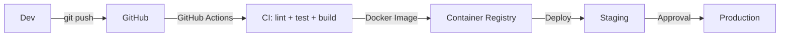

# Plano de Desenvolvimento — Roadmap

## 1. Funcionalidades já implementadas

### Autenticação e Usuários
- [x] Cadastro com validação de email
- [x] Login com JWT (access + refresh token)
- [x] Recuperação de senha (email token)
- [x] Alteração de senha (autenticado)
- [x] Upload de avatar (2MB, imagens)
- [x] Perfil do usuário (editar nome, username)
- [x] Confirmação de email
- [x] Gestão de usuários (admin: listar, editar, desativar)

### Projetos
- [x] CRUD completo de projetos
- [x] Arquivar/desarquivar projetos
- [x] Adicionar/remover membros por username ou ID
- [x] Status: ACTIVE, ARCHIVED, COMPLETED, PLANNING
- [x] Vínculo com clientes

### Tarefas (Kanban)
- [x] CRUD de tarefas
- [x] Status: NOT_STARTED, IN_PROGRESS, PAUSED, IN_REVIEW, COMPLETED
- [x] Prioridade: LOW, MEDIUM, HIGH, URGENT
- [x] Atribuição de responsável
- [x] Data de vencimento
- [x] Posição (ordenamento drag & drop)
- [x] Histórico de alterações (TaskHistory)
- [x] Comentários com respostas aninhadas
- [x] Filtros (status, prioridade, responsável, data)

### Chat e Grupos
- [x] Grupos de chat por projeto
- [x] Mensagens em tempo real (Socket.IO)
- [x] Indicador de digitação
- [x] Mensagens com arquivos anexados
- [x] Histórico de mensagens
- [x] Busca em mensagens
- [x] Direct Messages (DM) entre usuários
- [x] Entrar/sair de grupos

### Arquivos e Pastas
- [x] Upload de qualquer formato de arquivo
- [x] Sistema de versões de arquivos
- [x] Download de arquivos
- [x] Pastas organizacionais aninhadas (subpastas)
- [x] Vinculação a tarefas, grupos ou entregas
- [x] Lixeira com restaurar/exclusão permanente
- [x] Fallback local (quando MinIO indisponível)

### Entregas
- [x] CRUD de entregas
- [x] Status: IN_PRODUCTION, IN_REVIEW, CORRECTIONS, APPROVED, REJECTED
- [x] Revisão com nota
- [x] Versionamento de entregas

### Dashboard e Relatórios
- [x] Dashboard com indicadores (projetos, tarefas, produtividade)
- [x] Cache Redis (60s TTL)
- [x] Relatório de produtividade
- [x] Relatório de entregas
- [x] Relatório de atrasos
- [x] Relatório por colaborador
- [x] Relatório por projeto
- [x] Exportação CSV, XLSX, PDF

### Notificações
- [x] Notificações no banco de dados
- [x] Push notifications (Web Push API)
- [x] Marcar como lida / ler todas
- [x] Excluir notificações

### Calendário
- [x] Visualização de eventos (tarefas com data)

### Busca
- [x] Busca global (projetos, tarefas, usuários, arquivos, mensagens, entregas)
- [x] Search case-insensitive

### Clientes
- [x] CRUD de clientes
- [x] Vinculação a projetos

### Planos e Assinatura
- [x] CRUD de planos (admin)
- [x] Verificação de limites (projetos, membros, storage)
- [x] Histórico de mudanças de plano

### Administração
- [x] Gestão de cargos (roles) e permissões
- [x] Auditoria de ações
- [x] Backup manual e automático (Cron diário)
- [x] Paginação em listas

### Infraestrutura
- [x] Docker Compose completo
- [x] MinIO + Redis + PostgreSQL containerizados
- [x] CORS configurado
- [x] Validação com class-validator
- [x] Tema claro/escuro
- [x] Responsividade (mobile, tablet, desktop)

### Visualizador 3D
- [x] Página de visualização 3D (Three.js)
- [x] Integração com arquivos do sistema

---

## 2. Curto Prazo (Próximas 2 Semanas)

### Prioridade Crítica

| Tarefa | Esforço | Impacto | Módulo |
|--------|---------|---------|--------|
| Implementar checkout ASAAS/Stripe | 5 dias | Alto | Plans |
| Tela de planos e upgrade no frontend | 3 dias | Alto | Frontend |
| Feature gating (bloquear funcionalidades premium) | 2 dias | Alto | Plans |
| Página de pagamento e confirmação | 2 dias | Alto | Frontend |
| Webhooks de pagamento (ASAAS) | 3 dias | Alto | Plans |

### Melhorias Técnicas

| Tarefa | Esforço | Módulo |
|--------|---------|--------|
| Adicionar índices no PostgreSQL | 2h | DB |
| Testes de integração para auth (Jest) | 2 dias | Auth |
| Tratamento de erros consistente no frontend | 2 dias | Frontend |
| Loading states em todas as páginas | 1 dia | Frontend |
| Retry automático em falhas de upload | 1 dia | Files |

---

## 3. Médio Prazo (1-2 meses)

### Funcionalidades

| Funcionalidade | Esforço | Módulo |
|---------------|---------|--------|
| **Templates de projeto** (modelos pré-definidos) | 4 dias | Projects |
| **Checklists em tarefas** (subtarefas) | 3 dias | Tasks |
| **Etiquetas/Tags** em tarefas e projetos | 3 dias | Tasks |
| **Favoritar** projetos e tarefas | 2 dias | Tasks |
| **Comentários com formatação** (Markdown) | 3 dias | Comments |
| **Notificações por email** em tempo real | 2 dias | Notifications |
| **Múltiplos quadros Kanban** por projeto | 3 dias | Tasks |
| **Importação** (CSV, Trello, Monday) | 5 dias | Tasks |
| **Gráficos no dashboard** (Recharts já instalado) | 3 dias | Dashboard |
| **Relatório financeiro** por projeto | 4 dias | Reports |
| **Integração com Google Calendar** | 3 dias | Calendar |

### Infraestrutura

| Tarefa | Esforço | Descrição |
|--------|---------|-----------|
| Redis adapter para Socket.IO | 1 dia | Escalabilidade horizontal |
| Testes de carga (k6) | 2 dias | Identificar gargalos |
| CI/CD pipeline (GitHub Actions) | 2 dias | Deploy automático |
| Rate limiting (Redis) | 1 dia | Segurança |
| Sentry para monitoramento de erros | 1 dia | Observabilidade |

### Técnico

| Tarefa | Esforço |
|--------|---------|
| Refatorar `any` types nos controllers para DTOs | 3 dias |
| Adicionar testes unitários (alcançar 40% coverage) | 5 dias |
| Migrar de CommonJS para ESM (se viável) | 2 dias |
| Documentação automática da API (Swagger/OpenAPI) | 3 dias |
| Adicionar Husky + lint-staged para pre-commit | 1 dia |

---

## 4. Longo Prazo (3-6 meses)

### 4.1 Decomposição em Microserviços (se necessário)

- Auth Service independente
- File Service com workers dedicados
- Notification Service async (fila Redis/RabbitMQ)
- Realtime Service separado

### 4.2 Funcionalidades Enterprise

- **SSO** (SAML 2.0, OIDC, Google Workspace)
- **SCIM** para provisionamento automático de usuários
- **GDPR/LGPD compliance** (exportar dados, excluir conta)
- **Data residency** (escolher região do servidor)
- **API Pública** (REST + rate limiting + API keys)
- **Webhooks** para eventos do sistema (task created, delivery approved)
- **On-premise** deploy (Docker + K8s com licenciamento)

### 4.3 Experiência do Usuário

- **Modo escuro completo** (fora do tema atual)
- **Mobile app** (React Native ou PWA avançado)
- **Notificações push** no mobile (Firebase Cloud Messaging)
- **Offline-first** (Service Worker, IndexedDB)
- **Atalhos de teclado** (Kanban, navegação)
- **Drag & drop** para arquivos em pastas

### 4.4 Inteligência e Automação

- **IA generativa** (sugestão de tarefas, descrições automáticas)
- **Recomendação de prioridade** baseada em prazos e carga
- **Relatórios automáticos** enviados por email semanalmente
- **Detecção de sobrecarga** de membros da equipe

---

## 5. Dívida Técnica

### Itens Identificados

| Item | Severidade | Esforço | Descrição |
|------|-----------|---------|-----------|
| Uso de `any` nos DTOs | Alta | 3 dias | Tipos fortemente tipados |
| Sem validação de permissão em algumas rotas | Média | 2 dias | Verificar roles em operations críticas |
| Cache limitado ao dashboard | Média | 2 dias | Expandir Redis cache |
| Sem testes de integração | Alta | 5 dias | Testar fluxos completos |
| Error handling inconsistente | Média | 3 dias | Padronizar mensagens de erro |
| Seed estático (sem variedade) | Baixa | 1 dia | Dados de seed mais realistas |
| Paginação sem max limit | Média | 1 dia | Limitar page size máximo |
| Sem rate limiting | Alta | 2 dias | Proteger contra abuso |
| Variáveis de ambiente sem validação | Média | 1 dia | Zod ou Joi para validação |
| Docker sem multi-stage otimizado | Baixa | 1 dia | Reduzir imagem final |

### Plano de Redução

```
Semana 1-2:  any types, rate limiting, validação de permissão
Semana 3-4:  Testes de integração, paginação, error handling
Semana 5-6:  Redis cache expandido, seed, validação de env
Semana 7-8:  Docker otimizado, coverage tests
```

---

## 6. Estratégia de Testes

### Status Atual

| Tipo | Coverage | Arquivos |
|------|----------|----------|
| Unitários (backend) | ~15% | `chat.service.spec.ts`, `email.service.spec.ts`, `plan-limits.service.spec.ts`, `files.service.spec.ts` |
| Unitários (frontend) | ~5% | `MentionsInput.spec.tsx`, `utils.spec.ts`, `i18n.spec.ts` |
| Integração | 0% | - |
| E2E | 0% | - |

### Alvos

| Fase | Tipo | Meta |
|------|------|------|
| Curto prazo | Unitários services | 40% coverage |
| Médio prazo | Integração controllers + DB | 60% coverage |
| Longo prazo | E2E (Cypress/Playwright) | Fluxos críticos |
| Contínuo | Testes nos PRs via CI | 80%+ para código novo |

### Plano de Implementação

```typescript
// Exemplo de teste de integração
describe('AuthController', () => {
  it('deve registrar e retornar tokens', async () => {
    const response = await request(app)
      .post('/api/auth/register')
      .send({ name: 'Teste', email: 'teste@teste.com', password: '123456' });
    
    expect(response.status).toBe(201);
    expect(response.body).toHaveProperty('accessToken');
    expect(response.body).toHaveProperty('refreshToken');
  });
});
```

### Ferramentas

- **Jest** — Test runner (já configurado em ambos projetos)
- **Supertest** — Testes HTTP para NestJS
- **Testing Library** — Testes de componentes React (já instalado)
- **Cypress** ou **Playwright** — Testes E2E (a adicionar)
- **MSW** (Mock Service Worker) — Mock de API em testes (futuro)

---

## 7. Estratégia de Deploy

### Fases

#### Fase 1 — Desenvolvimento (atual)
```bash
# Local
npm run dev  # concurrently roda backend + frontend
```

#### Fase 2 — Homologação
```bash
# Servidor único com Docker
docker-compose up -d
```

#### Fase 3 — Produção (planejado)



**Stack de Produção**:
- **Opção A** — VPS única (início): Docker Compose em servidor 2vCPU/4GB
- **Opção B** — Escalado: Kubernetes (DOKS, EKS, GKE)
- **Banco**: PostgreSQL managed (Render, Supabase, Neon)
- **Redis**: Redis managed (Upstash, Redis Cloud)
- **Storage**: MinIO cluster ou S3 direto
- **CDN**: Cloudflare ou BunnyCDN
- **Monitoramento**: Grafana + Prometheus ou Datadog

### Variáveis de Ambiente por Ambiente

```env
# .env.production
NODE_ENV=production
DATABASE_URL=postgresql://...
REDIS_URL=redis://...
MINIO_ENDPOINT=s3.amazonaws.com
MINIO_ACCESS_KEY=...
MINIO_SECRET_KEY=...
JWT_SECRET=...
JWT_EXPIRATION=15m
SMTP_HOST=smtp.sendgrid.net
CORS_ORIGIN=https://app.teamflow.com.br
VAPID_PUBLIC_KEY=...
VAPID_PRIVATE_KEY=...
SENTRY_DSN=...
```

---

## 8. Resumo Timeline

```
Semana 1-2  │ Pagamentos · Feature Gating · Testes Auth
Semana 3-4  │ Templates · Checklists · Tags · Rate Limiting
Semana 5-6  │ Relatórios avançados · Importação · CI/CD
Semana 7-8  │ Google Calendar · Gráficos Dashboard · Melhorias Chat
Mês 3-4     │ API Pública · Webhooks · Swagger · Mobile PWA
Mês 5-6     │ Microserviços · SSO · On-premise · AI Features
```
