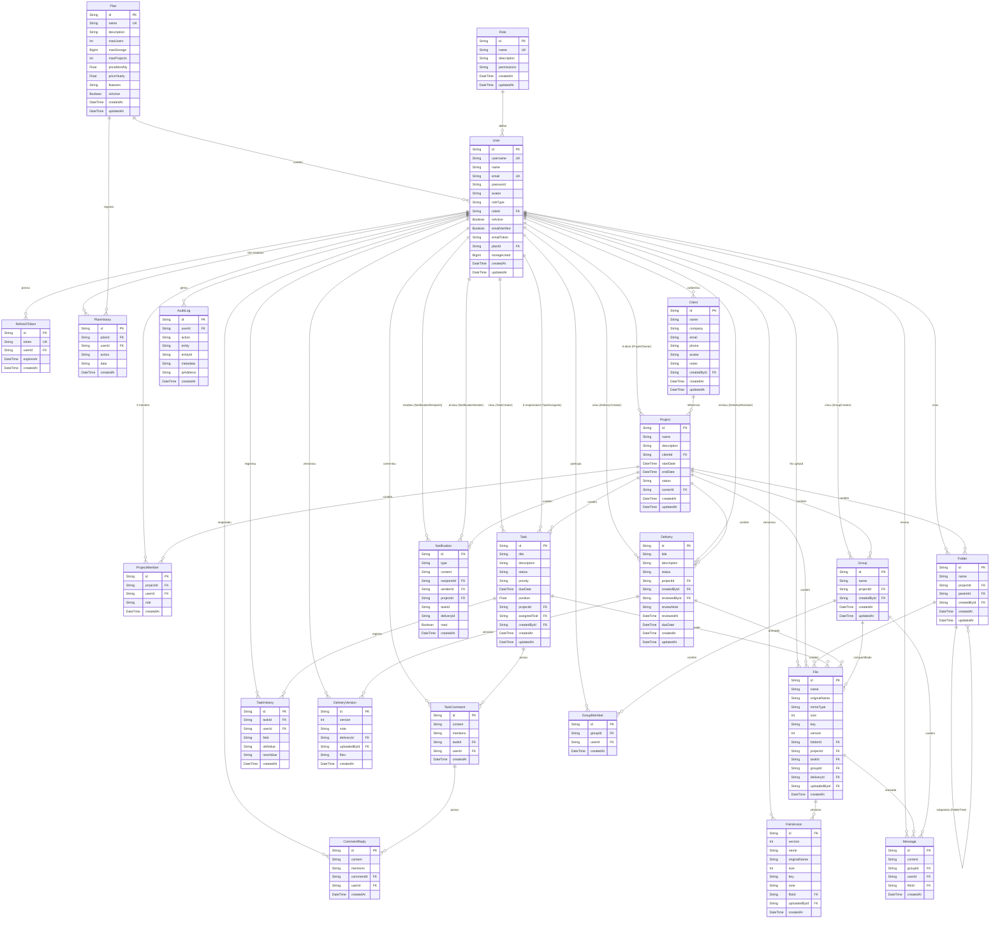

# Diagrama Entidade-Relacionamento (ERD)

## Legenda

| Símbolo | Significado |
|---------|-------------|
| `||--o{` | Um para muitos (ex: um User possui muitos Projects) |
| `||--||` | Um para um |
| `PK` | Chave primária |
| `FK` | Chave estrangeira |
| `UK` | Chave única |

## Modelos (23 no total)

| # | Modelo | Descrição |
|---|--------|-----------|
| 1 | **User** | Usuários do sistema (admin, líder, funcionário) |
| 2 | **RefreshToken** | Tokens de renovação JWT |
| 3 | **Plan** | Planos de assinatura (Gratuito, Equipe, Empresa, Corporativo) |
| 4 | **PlanHistory** | Histórico de mudanças de plano |
| 5 | **Role** | Cargos com permissões customizáveis |
| 6 | **Client** | Clientes vinculados a projetos |
| 7 | **Project** | Projetos |
| 8 | **ProjectMember** | Membros de um projeto (N:N User-Project) |
| 9 | **Folder** | Pastas organizacionais dentro de projetos |
| 10 | **Task** | Tarefas do Kanban |
| 11 | **TaskComment** | Comentários em tarefas |
| 12 | **CommentReply** | Respostas a comentários |
| 13 | **TaskHistory** | Histórico de alterações de tarefas |
| 14 | **Delivery** | Entregas associadas a projetos |
| 15 | **DeliveryVersion** | Versões de uma entrega |
| 16 | **File** | Arquivos enviados |
| 17 | **FileVersion** | Versões de arquivos |
| 18 | **Group** | Grupos de chat |
| 19 | **GroupMember** | Membros de grupos de chat |
| 20 | **Message** | Mensagens de chat |
| 21 | **Notification** | Notificações do sistema |
| 22 | **AuditLog** | Trilha de auditoria |
