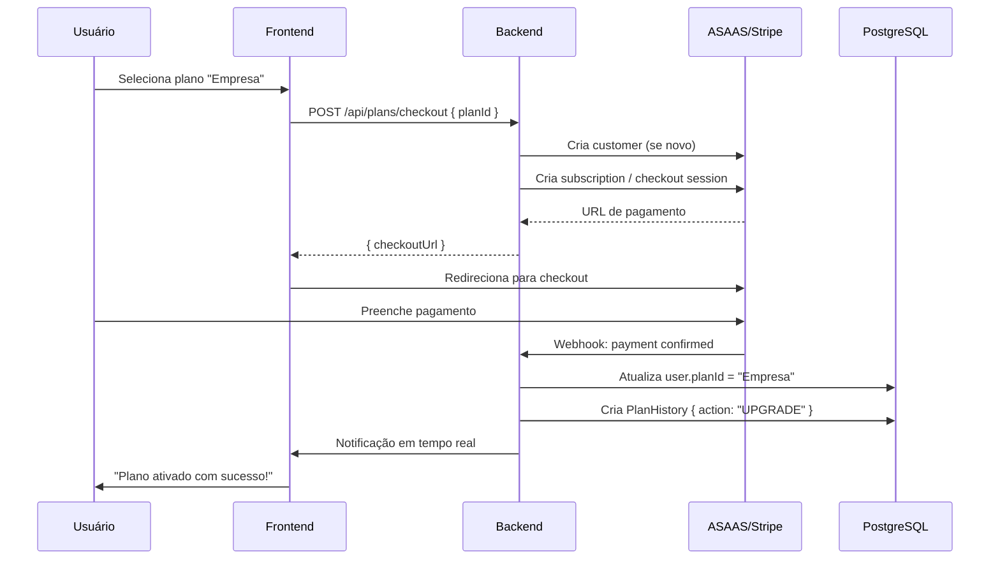

# Plano de Monetização

## 1. Planos Atuais

O sistema TeamFlow possui 4 planos configurados no banco de dados (tabela `plans`). Os limites são aplicados dinamicamente pelo `PlanLimitsService`.

| Característica | Gratuito | Equipe | Empresa | Corporativo |
|---------------|----------|--------|---------|-------------|
| **Preço mensal** | Grátis | R$ 29 | R$ 79 | R$ 199 |
| **Preço anual** | Grátis | R$ 290 | R$ 790 | R$ 1.990 |
| **Usuários** | 3 | 10 | 50 | Ilimitado |
| **Projetos** | 2 | 15 | 50 | Ilimitado |
| **Armazenamento** | 100MB | 5GB | 25GB | 100GB+ |
| **Suporte** | - | Email | Prioridade | Dedicated SLA |

### Funcionalidades por Plano

| Funcionalidade | Gratuito | Equipe | Empresa | Corporativo |
|---------------|----------|--------|---------|-------------|
| Kanban drag & drop | ✓ | ✓ | ✓ | ✓ |
| Chat em tempo real | ✓ | ✓ | ✓ | ✓ |
| Upload de arquivos | ✓ | ✓ | ✓ | ✓ |
| Comentários em tarefas | ✓ | ✓ | ✓ | ✓ |
| Histórico de tarefas | ✓ | ✓ | ✓ | ✓ |
| Dashboard | ✓ | ✓ | ✓ | ✓ |
| Clientes | ✓ | ✓ | ✓ | ✓ |
| Grupos de chat | ✓ | ✓ | ✓ | ✓ |
| Entregas | ✓ | ✓ | ✓ | ✓ |
| Calendar view | ✓ | ✓ | ✓ | ✓ |
| Busca global | ✓ | ✓ | ✓ | ✓ |
| **Relatórios** | ✗ | Básico | Avançado | Completo |
| **Exportação CSV/PDF/XLSX** | ✗ | ✓ | ✓ | ✓ |
| **Múltiplos grupos** | 2 | 10 | Ilimitado | Ilimitado |
| **Visualizador 3D** | ✗ | ✗ | ✓ | ✓ |
| **API Pública** | ✗ | ✗ | Básica | Completa |
| **Roles customizadas** | ✗ | ✗ | ✓ | ✓ |
| **Auditoria** | ✗ | ✗ | ✓ | ✓ |
| **Backup automático** | ✗ | ✗ | ✗ | ✓ |
| **SLA** | - | - | 99.9% | 99.99% |
| **On-premise** | ✗ | ✗ | ✗ | ✓ |

---

## 2. Estratégia de Preços

### 2.1 Precificação Per Seat vs Flat

**Atualmente**: Preço flat por plano (todos do time pagam o mesmo).

**Recomendação**: Modelo híbrido:
- **Gratuito**: 3 usuários, funcionalidades básicas (viral)
- **Equipe**: Flat R$ 29/mês para até 10 usuários
- **Empresa**: Flat R$ 79/mês para até 50 usuários
- **Corporativo**: R$ 199/mês base + R$ 5/usuário adicional após 50

### 2.2 Desconto Anual

- Mensal: preço cheio
- Anual: 2 meses grátis (16.7% de desconto)
- Estratégia de cobrança: Stripe/ASAAS com faturamento recorrente

### 2.3 Período de Trial

- 14 dias de trial no plano Empresa (sem cartão)
- Conversão esperada: 8-12% após trial

---

## 3. Feature Gating (PlanLimitsService)

### 3.1 Implementação Atual

O `PlanLimitsService` já implementa 3 verificações:

```typescript
// Limite de projetos
checkProjectLimit(userId: string): verifica maxProjects do plano

// Limite de membros
checkMemberLimit(userId: string): verifica maxUsers do plano

// Limite de armazenamento
checkStorageLimit(userId: string, additionalBytes: number): verifica maxStorage
```

### 3.2 Expansão do Feature Gating

```typescript
async checkFeatureAccess(userId: string, feature: string): Promise<boolean> {
  const user = await this.prisma.user.findUnique({
    where: { id: userId },
    include: { plan: true },
  });
  if (!user?.plan) return false; // Sem plano = acesso básico

  const planFeatures = JSON.parse(user.plan.features);
  return planFeatures.includes(feature);
}
```

**Features para gating**:
- `reports-export` — Exportação de relatórios
- `audit-log` — Trilha de auditoria
- `custom-roles` — Roles customizadas
- `backup-automatic` — Backup automático
- `3d-viewer` — Visualizador 3D
- `api-public` — API pública
- `advanced-reports` — Relatórios avançados

### 3.3 Aplicação nos Controllers

```typescript
@Get('export/productivity')
async exportProductivity(@CurrentUser('sub') userId: string, ...) {
  await this.planLimitsService.checkFeatureAccess(userId, 'reports-export');
  // ... lógica de exportação
}
```

---

## 4. Oportunidades de Upsell

### 4.1 Upsell no Ciclo de Vida

```
Gratuito ──(limite de projetos)──→ Equipe
  │                                    │
  │(limite de membros)                 │(precisa de relatórios)
  ▼                                    ▼
Equipe ──────────────→ Empresa ──────────────→ Corporativo
```

### 4.2 Gatilhos de Upsell

| Gatilho | Plano Atual | Upsell Para | Mensagem |
|---------|-------------|-------------|----------|
| Atingiu limite de projetos | Gratuito | Equipe | "Você criou 2 projetos. Faça upgrade para criar quantos precisar!" |
| Atingiu limite de membros | Equipe | Empresa | "Sua equipe cresceu! Adicione mais 40 membros com o plano Empresa." |
| Tentou exportar relatório | Gratuito | Equipe | "Relatórios profissionais disponíveis no plano Equipe." |
| Armazenamento quase cheio | Qualquer | Próximo nível | "Você está usando 80% do armazenamento." |
| Pediu suporte prioritário | Empresa | Corporativo | "Suporte dedicado com SLA 4h no plano Corporativo." |

### 4.3 Add-ons (Faturamento à Parte)

| Add-on | Preço | Descrição |
|--------|-------|-----------|
| Storage extra (10GB) | R$ 9/mês | Armazenamento adicional |
| Usuário extra (após limite) | R$ 5/mês | Por usuário adicional |
| Suporte premium | R$ 49/mês | SLA 4h, chat dedicado |
| On-premise license | R$ 499/mês | Instalação no servidor do cliente |
| White label | R$ 299/mês | Marca própria |

---

## 5. Roadmap de Funcionalidades Enterprise

### Fase 1 — MVP Pago (2-4 semanas)
- [x] Feature gating básico (projetos, membros, storage)
- [ ] Integração com ASAAS para cobrança (PIX, boleto, cartão)
- [ ] Tela de planos no frontend
- [ ] Restrição de funcionalidades premium

### Fase 2 — Completo (1-2 meses)
- [ ] Integração Stripe (cartão internacional)
- [ ] Cupons de desconto e promoções
- [ ] Histórico de pagamentos
- [ ] Faturamento recorrente automatizado
- [ ] Upgrade/downgrade sem perder dados
- [ ] Métricas de uso para cobrança (usage-based billing)

### Fase 3 — Enterprise (3-6 meses)
- [ ] SSO (SAML, OIDC)
- [ ] SCIM para provisionamento de usuários
- [ ] SLA agreements com contrato
- [ ] On-premise deployment (Docker + Kubernetes)
- [ ] Audit logs avançados (retenção 7 anos)
- [ ] Compliance (LGPD, SOC 2)
- [ ] Data residency (escolha da região)

---

## 6. Integração com Pagamentos

### 6.1 ASAAS (Brasil)

Recomendado como primeira integração por ser o gateway mais usado no Brasil.

```typescript
// plans/asaas.service.ts
class AsaasService {
  async createCustomer(user: User): Promise<string> { /* ASAAS /customers */ }
  async createSubscription(customerId: string, planId: string): Promise<string> {
    // ASAAS /subscriptions com billingType = PIX | BOLETO | CREDIT_CARD
  }
  async handleWebhook(event: AsaasEvent): Promise<void> {
    // Atualizar status do plano baseado em: PAYMENT_CONFIRMED, PAYMENT_OVERDUE, SUBSCRIPTION_CANCELED
  }
}
```

**Webhooks ASAAS**:
- `PAYMENT_CONFIRMED` → Ativar/renovar assinatura
- `PAYMENT_OVERDUE` → Enviar email de cobrança, restringir após 5 dias
- `PAYMENT_REFUNDED` → Reverter assinatura
- `SUBSCRIPTION_CANCELED` → Mover para plano Gratuito

### 6.2 Stripe (Internacional)

```typescript
class StripeService {
  async createCheckoutSession(planId: string, userId: string): Promise<string> {
    return stripe.checkout.sessions.create({
      mode: 'subscription',
      line_items: [{ price: priceId, quantity: 1 }],
      metadata: { userId, planId },
      success_url: `${APP_URL}/plans/success`,
      cancel_url: `${APP_URL}/plans`,
    });
  }
}
```

### 6.3 Fluxo de Checkout



### 6.4 Tabela de Preços no Banco

```sql
INSERT INTO plans (id, name, description, max_users, max_storage, max_projects, price_monthly, price_yearly, features)
VALUES
  ('gratuito', 'Gratuito', 'Para pequenos times começando', 3, 104857600, 2, 0, 0, '["kanban","chat","upload","comments","dashboard","clients","groups","deliveries","calendar","search"]'),
  ('equipe', 'Equipe', 'Para times em crescimento', 10, 5368709120, 15, 29, 290, '["kanban","chat","upload","comments","dashboard","clients","groups","deliveries","calendar","search","reports-basic","export-csv"]'),
  ('empresa', 'Empresa', 'Para empresas com processos avançados', 50, 26843545600, 50, 79, 790, '["kanban","chat","upload","comments","dashboard","clients","groups","deliveries","calendar","search","reports-advanced","export-all","3d-viewer","custom-roles","audit-log"]'),
  ('corporativo', 'Corporativo', 'Para organizações que exigem controle total', 999999, 107374182400, 999999, 199, 1990, '["kanban","chat","upload","comments","dashboard","clients","groups","deliveries","calendar","search","reports-advanced","export-all","3d-viewer","custom-roles","audit-log","backup-auto","api-public","sla","on-premise"]');
```

---

## 7. Projeções de Receita

### 7.1 Premissas

- **TAM**: 10.000 PMEs brasileiras que usam ferramentas de projeto
- **Conversão trial → pago**: 10%
- **Churn mensal**: 5% (gratuito), 3% (equipe), 2% (empresa), 1% (corporativo)
- **CAC**: R$ 50 (anúncios + conteúdo), R$ 200 (corporativo, venda consultiva)

### 7.2 Projeção 12 Meses (conservadora)

| Mês | Usuários | Gratuito | Equipe | Empresa | Corporativo | MRR |
|-----|----------|----------|--------|---------|-------------|-----|
| 1 | 300 | 270 | 20 | 8 | 2 | R$ 1.176 |
| 2 | 500 | 440 | 38 | 16 | 6 | R$ 2.598 |
| 3 | 800 | 690 | 60 | 38 | 12 | R$ 5.386 |
| 4 | 1.200 | 1.010 | 90 | 76 | 24 | R$ 10.174 |
| 5 | 1.800 | 1.480 | 140 | 120 | 60 | R$ 20.180 |
| 6 | 2.500 | 1.990 | 210 | 180 | 120 | R$ 38.250 |
| 7 | 3.500 | 2.690 | 310 | 260 | 240 | R$ 67.610 |
| 8 | 4.500 | 3.390 | 410 | 340 | 360 | R$ 95.090 |
| 9 | 5.500 | 4.090 | 510 | 420 | 480 | R$ 121.760 |
| 10 | 6.500 | 4.790 | 610 | 500 | 600 | R$ 147.640 |
| 11 | 7.500 | 5.490 | 710 | 580 | 720 | R$ 172.730 |
| 12 | 8.000 | 5.790 | 760 | 630 | 820 | R$ 194.730 |

**MRR no mês 12**: ~R$ 194.730 (~$39K USD)
**ARR projetado**: ~R$ 2.3M (~$460K USD)

### 7.3 KPIs de Monetização

| KPI | Meta | Fórmula |
|-----|------|---------|
| LTV | R$ 600+ | Ticket médio × (1/churn) |
| CAC | < R$ 200 | Marketing + Vendas / Novos clientes |
| LTV/CAC | > 3x | LTV ÷ CAC |
| MRR | R$ 194K/mês (12m) | Soma de receitas recorrentes |
| Churn | < 3% geral | Cancelamentos / Total assinantes |
| Conversão trial | > 10% | Trials que viram pagos |
| NPS | > 50 | Pesquisa de satisfação |

---

## 8. Considerações Finais

### Regras de Downgrade

- Ao fazer downgrade, dados não são perdidos (apenas bloqueados)
- Exibir banner: "Seu plano atual não inclui esta funcionalidade. Faça upgrade."
- Após 30 dias sem pagamento, mover automaticamente para Gratuito
- Manter dados por 90 dias após cancelamento (reativação possível)

### Modelo Freemium

- Gratuito é essencial para aquisição orgânica
- 80% dos recursos disponíveis no gratuito (geração de dependência)
- 20% dos recursos premium geram conversão (relatórios, exportação)
- Limites baixos (2 projetos, 3 usuários) criam atrito positivo

### Precificação Internacional

- USD: $6 / $19 / $49 / $149 (preços sugeridos)
- EUR: €5 / €17 / €45 / €135
- Ajustar por paridade de poder de compra para cada região
