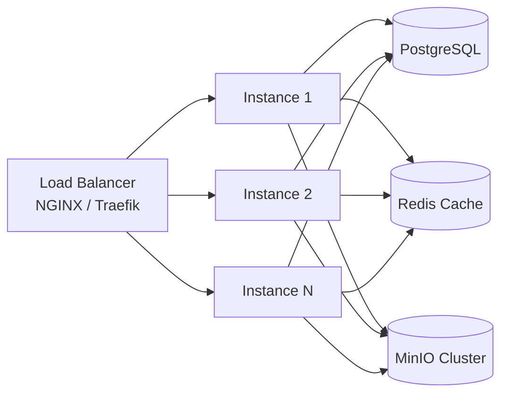
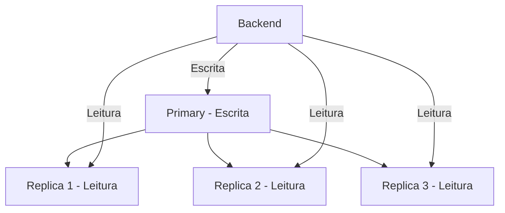
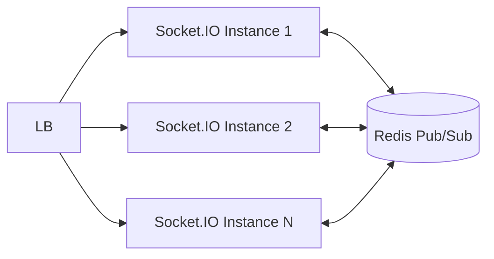
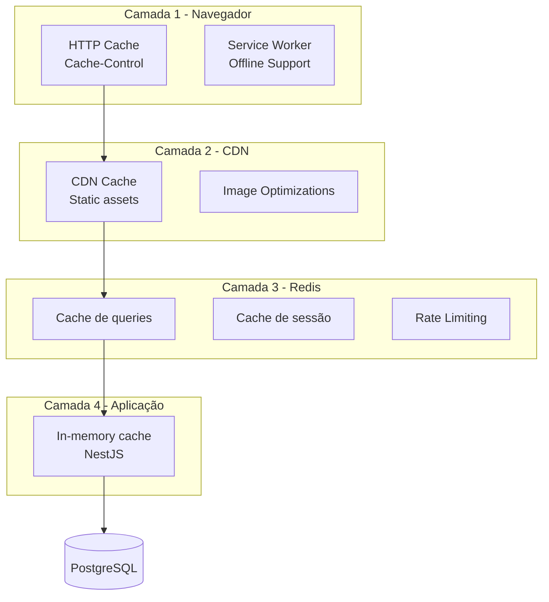

# Plano de Escalabilidade

## 1. Limitações da Arquitetura Atual

| Componente | Limitação | Impacto |
|------------|-----------|---------|
| **NestJS single instance** | Sem cluster, sem workers | CPU limitada a 1 core efetivo |
| **Socket.IO sem adapter** | Gateway não compartilha estado entre instâncias | Mensagens não propagam para outras instâncias |
| **Redis não configurado para rate limit/sessão** | Apenas cache do dashboard | Subutilização do Redis |
| **MinIO single-node** | Sem replicação, sem CDN | Latência para usuários distantes, SPOF |
| **PostgreSQL single instance** | Sem réplicas de leitura | Contenção em alta concorrência |
| **Upload síncrono** | Multer bufferiza em memória antes de enviar ao MinIO | Limite de memória para arquivos grandes |
| **Backup local** | Backup salvo no disco do container | Perda se o volume for destruído |
| **Cache local ausente** | Dashboard cache 60s Redis, demais queries direto ao banco | Alto custo de queries repetitivas |

---

## 2. Escalabilidade Horizontal do Backend

### 2.1 Múltiplas Instâncias NestJS



**Configuração**:
- Load balancer (NGINX, Traefik, ou AWS ALB) com health checks em `/api/dashboard`
- Até 4-6 instâncias pequenas (1-2 vCPU, 2GB RAM) vs 1 instância grande
- Sessões stateless (JWT não armazenado em servidor)

### 2.2 Sticky Sessions para WebSocket

Para Socket.IO com múltiplas instâncias:

```
Opção 1: Redis Adapter (recomendada)
  npm install @socket.io/redis-adapter
  Config: createAdapter(redisClient, redisSubClient)

Opção 2: Sticky Sessions (NGINX)
  upstream backend {
    ip_hash;
    server backend1:4000;
    server backend2:4000;
  }
```

A Opção 1 é superior pois permite broadcast eficiente sem perder mensagens se uma instância falhar.

### 2.3 Configuração do Redis Adapter

```typescript
// main.ts
import { createAdapter } from '@socket.io/redis-adapter';
import { createClient } from 'redis';

const pubClient = createClient({ url: process.env.REDIS_URL });
const subClient = pubClient.duplicate();
await Promise.all([pubClient.connect(), subClient.connect()]);

app.useWebSocketAdapter(new RedisAdapter(pubClient, subClient));
```

---

## 3. Escalabilidade do Banco de Dados

### 3.1 Read Replicas



**Implementação com Prisma**:
```typescript
const prisma = new PrismaClient({
  datasources: {
    db: { url: process.env.DATABASE_URL },          // Escrita (primary)
    db_read: { url: process.env.DATABASE_REPLICA_URL }, // Leitura (replica)
  },
});
```

**Passos**:
1. Configurar replicação PostgreSQL (streaming replication)
2. Adicionar `DATABASE_REPLICA_URL` ao .env
3. Modificar services para usar datasource de leitura em queries GET

### 3.2 Connection Pooling com PgBouncer

Situação atual: Prisma gerencia pool interno.

**Com PgBouncer**:
```yaml
services:
  pgbouncer:
    image: edoburu/pgbouncer:latest
    environment:
      DB_HOST: postgres
      DB_PORT: 5432
      DB_USER: teamflow
      DB_PASSWORD: teamflow
      DB_NAME: teamflow
      POOL_MODE: transaction
      MAX_CLIENT_CONN: 100
      DEFAULT_POOL_SIZE: 25
    ports:
      - "6432:5432"
```

Benefício: Gerencia centenas de conexões vindas de múltiplas instâncias NestJS.

### 3.3 Índices Recomendados

Já existentes (via Prisma `@unique`):
- `users.email`, `users.username`
- `project_members(projectId, userId)`
- `folders(projectId, name, parentId)`
- `group_members(groupId, userId)`

Índices adicionais sugeridos:
```sql
CREATE INDEX idx_tasks_project_status ON tasks("projectId", "status");
CREATE INDEX idx_tasks_due_date ON tasks("dueDate") WHERE "dueDate" IS NOT NULL;
CREATE INDEX idx_notifications_recipient_read ON notifications("recipientId", "read");
CREATE INDEX idx_messages_group_created ON messages("groupId", "createdAt");
CREATE INDEX idx_audit_logs_created ON audit_logs("createdAt");
CREATE INDEX idx_deliveries_project ON deliveries("projectId");
CREATE INDEX idx_files_project ON files("projectId");
```

---

## 4. Escalabilidade de Armazenamento de Arquivos

### 4.1 MinIO Cluster

```yaml
services:
  minio-1: { image: minio/minio, command: "server --console-address :9001 /data" }
  minio-2: { image: minio/minio, command: "server --console-address :9002 /data" }
  minio-3: { image: minio/minio, command: "server --console-address :9003 /data" }
  minio-4: { image: minio/minio, command: "server --console-address :9004 /data" }
```

Modo distributed (4+ servidores com 4+ volumes):
```bash
minio server http://minio-{1..4}:9000/data{1..4}
```

### 4.2 CDN Integration

Após upload, gerar URL pré-assinada do MinIO e servir via CDN:

```typescript
async getPresignedUrl(fileName: string): Promise<string> {
  if (this.useLocalFallback) return `/api/files/download/${fileName}`;
  
  // Para arquivos grandes (>10MB), usar presigned URL
  const url = await this.client.presignedGetObject(this.bucket, fileName, 24 * 60 * 60);
  return url;
}
```

Opções de CDN:
- **Cloudflare R2**: Zero egress fee, integração S3-compatible
- **AWS CloudFront + S3**: Se migrar do MinIO para S3
- **BunnyCDN**: Custo mais baixo (~$1/TB)

### 4.3 Upload Otimizado

Para arquivos grandes (>100MB):
- **Upload em partes** (multipart upload)
- **Upload direto para MinIO** (presigned PUT URL) evitando passar pelo backend
- **Compressão automática** para imagens (WebP, AVIF)

---

## 5. Escalabilidade do Tempo Real (Socket.IO)

### 5.1 Arquitetura com Redis Adapter



### 5.2 Métricas alvo

| Métrica | Atual | Alvo |
|---------|-------|------|
| Conexões simultâneas | ~100 (single instance) | 10.000+ (com adapter) |
| Latência de broadcast | <50ms | <100ms (com adapter) |
| Mensagens/segundo | ~500 | 5.000+ |

### 5.3 Namespaces por Projeto

Para isolar tráfego:
```typescript
const projectNamespace = server.of(`/project-${projectId}`);
projectNamespace.on('connection', (socket) => { ... });
```

---

## 6. Estratégia de Cache em Múltiplas Camadas



### Estratégia de Cache no Redis

| Chave | TTL | Descrição |
|-------|-----|-----------|
| `dashboard:stats:{userId}` | 60s | Indicadores do dashboard |
| `project:{id}` | 300s | Detalhe do projeto c/ membros |
| `tasks:project:{id}` | 120s | Tarefas do projeto |
| `user:{id}:profile` | 600s | Perfil do usuário |
| `plans:list` | 3600s | Lista de planos |
| `search:recent:{userId}` | 300s | Resultados de busca recentes |

### Cache Invalidation

```typescript
async function invalidateProjectCache(projectId: string) {
  await redis.delPattern(`project:${projectId}`);
  await redis.delPattern(`tasks:project:${projectId}`);
  await redis.delPattern(`dashboard:stats:*`);
}
```

---

## 7. Candidatos a Microserviços

Se o monolito atual crescer além do ponto de ruptura, estas são as fronteiras naturais para decomposição:

| Microserviço | Responsabilidade | Motivo |
|-------------|-----------------|--------|
| **Auth Service** | Login, registro, JWT, refresh tokens | Carga de autenticação, isolamento de segurança |
| **File Service** | Upload, download, versões, MinIO | Operações de I/O intensivo, pode escalar independentemente |
| **Realtime Service** | WebSocket, chat, notificações push | Conexões longas, escalabilidade diferente de REST |
| **Notification Service** | Email, push, notificações in-app | Processamento assíncrono, filas |
| **Search Service** | Elasticsearch, indexação, busca full-text | Pode usar Elasticsearch dedicado |
| **Report Service** | Geração de relatórios, exportação CSV/PDF/XLSX | CPU intensivo, pode usar workers separados |
| **Backup Service** | Backup agendado, restore | Cron jobs, não precisa estar no main API |

### Estratégia de Comunicação

```
Serviços REST via API Gateway (Kong / Traefik)
Mensageria: Redis Pub/Sub ou RabbitMQ para eventos assíncronos
```

---

## 8. Projeção de Custos em Diferentes Escalas

### Cenário Pequeno (~100 usuários ativos)

| Recurso | Especificação | Custo Mensal (estimado) |
|---------|--------------|------------------------|
| 1 VPS (backend + frontend) | 2 vCPU, 4GB RAM | ~$15-25 |
| PostgreSQL (managed) | 1 vCPU, 2GB, 20GB SSD | ~$15 |
| Redis (managed) | 250MB | ~$5 |
| MinIO / S3 | 50GB storage | ~$5 |
| Domínio + Email | - | ~$5 |
| **Total** | | **~$45-55/mês** |

### Cenário Médio (~1.000 usuários ativos)

| Recurso | Especificação | Custo Mensal |
|---------|--------------|-------------|
| 2-3 VPS backend (cluster) | 2 vCPU, 4GB RAM cada | ~$60-90 |
| Load Balancer | - | ~$20 |
| PostgreSQL (managed) | 2 vCPU, 8GB, 100GB SSD | ~$80 |
| Read Replica PostgreSQL | 1 vCPU, 4GB | ~$40 |
| Redis (managed) | 2GB | ~$20 |
| CDN (Cloudflare R2 / Bunny) | 500GB transfer | ~$10 |
| File Storage (MinIO/S3) | 500GB | ~$25 |
| Monitoramento (Grafana + Prometheus) | - | ~$10 |
| **Total** | | **~$265-295/mês** |

### Cenário Grande (~10.000 usuários ativos)

| Recurso | Especificação | Custo Mensal |
|---------|--------------|-------------|
| 6-8 backend instances (k8s) | 2 vCPU, 4GB RAM | ~$300-500 |
| Load Balancer + API Gateway | - | ~$100 |
| PostgreSQL cluster (3 nós) | 4 vCPU, 16GB, 500GB SSD | ~$400-600 |
| PgBouncer | - | Incluso |
| Redis cluster (3 nós) | 8GB cada | ~$150 |
| CDN | 5TB transfer | ~$50-100 |
| File Storage | 5TB | ~$250 |
| Kubernetes cluster | 3-5 worker nodes | ~$200-400 |
| Observabilidade (Datadog/Grafana Cloud) | - | ~$100-200 |
| Elasticsearch (logs + search) | 3 nós | ~$300 |
| **Total** | | **~$1.850-2.550/mês** |

---

## 9. Ações Imediatas (Baixo Custo, Alto Impacto)

| Prioridade | Ação | Esforço | Impacto |
|-----------|------|---------|---------|
| 1 | Adicionar índices no PostgreSQL | 1 hora | Alto |
| 2 | Configurar Redis para cache de queries frequentes | 4 horas | Alto |
| 3 | Habilitar compressão de resposta (Gzip/Brotli) no NGINX | 1 hora | Médio |
| 4 | Implementar paginação consistente em todas listas | 8 horas | Alto |
| 5 | Ativar HTTP/2 no load balancer | 1 hora | Médio |
| 6 | Configurar CDN para arquivos estáticos e uploads | 4 horas | Médio |
| 7 | Implementar Redis Adapter para Socket.IO | 8 horas | Alto (para HA) |

---

## 10. Monitoramento e Observabilidade

### Métricas Essenciais

- **API**: Latência p95/p99, taxa de erro, throughput, conexões ativas
- **Banco**: Conexões ativas, queries lentas (>100ms), tamanho do banco, cache hit ratio
- **Redis**: Memory usage, cache hit ratio, command rate
- **MinIO**: Storage used, requests per second, error rate
- **Socket.IO**: Conexões ativas, mensagens/segundo, rooms ativos
- **Negócio**: Usuários ativos, projetos criados/dia, tasks completadas/dia

### Stack de Observabilidade

```yaml
serviços:
  prometheus: scrapes métricas do backend e infraestrutura
  grafana: dashboards de métricas e alertas
  loki: agregação de logs centralizados
  sentry: rastreamento de erros no frontend e backend
  uptime-kuma: monitoramento de health checks
```
